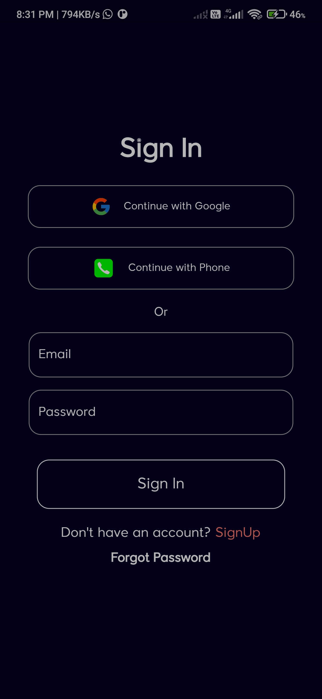
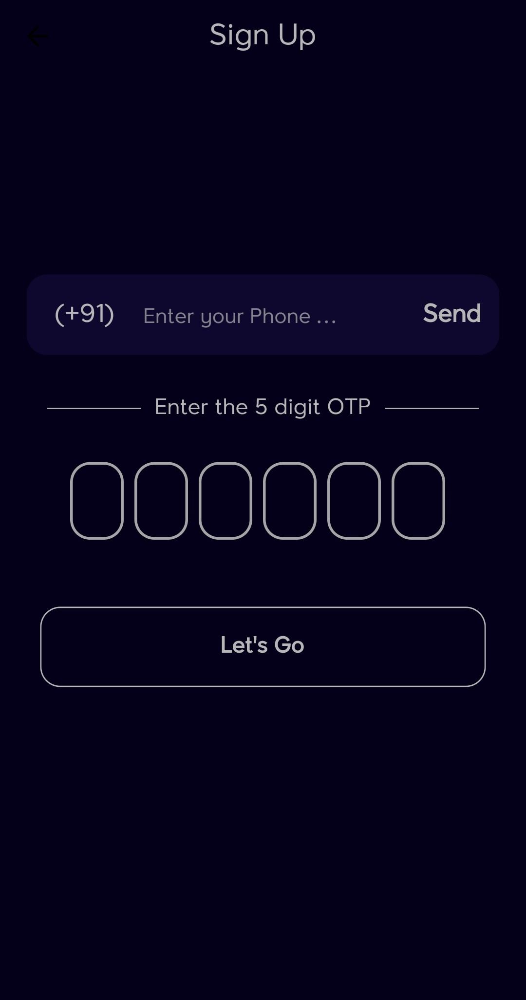
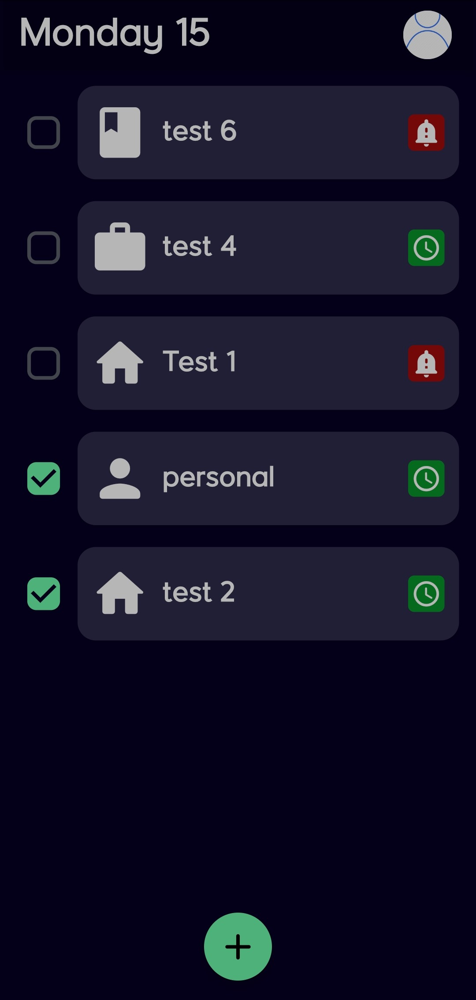
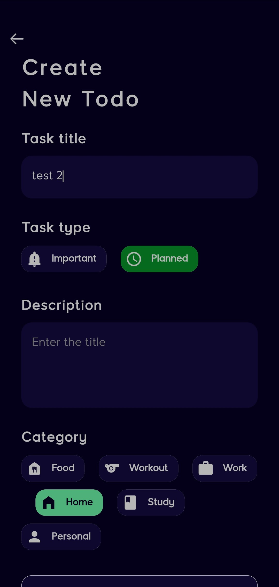

# todo_firebase

A simple Todo app with Firebase

   

## Credits 

Icons made by <a href="https://www.flaticon.com/authors/andinur" title="andinur">andinur</a> from <a href="https://www.flaticon.com/" title="Flaticon">www.flaticon.com</a>

